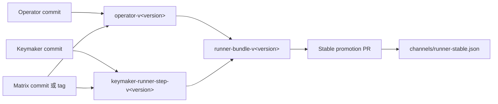

# Evolution 二进制发布操作指南

本文说明如何通过 `neohetj/evolution-releases` 发布 Operator、
`keymaker-runner-step` 和兼容的 Runner Bundle，并将经过评审的 Bundle 推进到 stable channel。

## 发布模型

组件源码和发布产物分离：源码仍位于各自私有仓库，交叉编译后的二进制、清单、校验和与
构建来源证明发布为 `evolution-releases` 的 GitHub Release Assets。



发布分为三个不可跳过的层级：

1. 分别发布 Operator 和 `keymaker-runner-step` 组件。
2. 使用两个已经存在的组件版本组成不可变 Runner Bundle。
3. 通过 PR 将某个 Bundle 推进到 stable channel。

## 版本与 Tag 规则

工作流输入中的版本不带 `v` 前缀，工作流会生成以下 Release Tag：

| 对象 | 版本输入示例 | Release Tag |
| --- | --- | --- |
| Operator | `0.1.0-alpha.1` | `operator-v0.1.0-alpha.1` |
| Runner Step | `0.1.0-alpha.1` | `keymaker-runner-step-v0.1.0-alpha.1` |
| Runner Bundle | `0.1.0-alpha.1` | `runner-bundle-v0.1.0-alpha.1` |

组件和 Bundle Release 均不可变。Release 一旦创建，不得删除后使用同一版本覆盖发布；需要修复时
发布新版本。

## 发布前准备

### 1. 权限

`evolution-releases` 仓库必须配置 Secret `RELEASE_SOURCE_TOKEN`。建议使用 fine-grained token
或 GitHub App token，并仅授予以下私有仓库的 Contents 只读权限：

- `neohetj/operator`
- `neohetj/keymaker`
- `neohetj/matrix`

该 Token 不需要 `evolution-releases` 的写权限。Release 创建、来源证明和 stable promotion 使用
工作流自身的 `GITHUB_TOKEN`。

### 2. 确认源码提交

只发布已经推送到远端、通过评审并完成验证的源码提交。不要填写本地未推送的 commit。

```bash
git -C /path/to/operator rev-parse HEAD
git -C /path/to/keymaker rev-parse HEAD
```

`source_commit` 必须是完整的 40 位小写 SHA。发布 `keymaker-runner-step` 前，还必须确认对应
Keymaker 提交包含以下目标：

```bash
git -C /path/to/keymaker show <keymaker-commit>:Makefile | grep '^release-runner-step:'
```

### 3. 选择 Matrix ref

`matrix_ref` 支持以下两种值：

- 完整的 40 位 Matrix commit SHA；
- Matrix 远端仓库中已经存在的不可变 tag。

不要填写 `main`、`master` 或其他分支。工作流对非 SHA 输入会检查
`refs/tags/<matrix_ref>`，普通分支无法通过校验。使用 tag 时，工作流仍会解析最终 40 位 commit，
并把原始 ref 和最终 commit 一起写入 Release notes。tag 名必须以字母或数字开头，且只能包含
字母、数字、点、下划线和连字符。

如果使用 tag，先确认远端存在该 tag：

```bash
git -C /path/to/Matrix ls-remote --tags origin "refs/tags/<matrix-tag>"
```

同一个 Runner Bundle 中的 Operator 和 Runner Step 建议使用同一个 Matrix commit 或 tag，避免
两个组件基于不同的 Matrix 合同构建。

### 4. 本地验证

在已经检出对应提交的干净工作树中执行检查。先确认 HEAD，再运行构建，避免为了验证而覆盖
本地未提交改动：

```bash
test "$(git -C /path/to/operator rev-parse HEAD)" = "<operator-commit>"
make -C /path/to/operator release-check

test "$(git -C /path/to/keymaker rev-parse HEAD)" = "<keymaker-commit>"
make -C /path/to/keymaker release-runner-step-check

make -C /path/to/evolution-releases check
```

`release-check` 会真实交叉构建 `darwin-arm64`、`darwin-amd64` 和 `windows-amd64`，执行前应
保证相邻工作区的 Matrix 源码与准备发布的 `matrix_ref` 一致。

## 第一步：发布 Operator

可以从 GitHub 页面操作：

1. 打开 `neohetj/evolution-releases` 的 Actions 页面。
2. 选择 **Publish component**。
3. 点击 **Run workflow**，分支选择最新 `main`。
4. 填写以下输入并运行：

| 输入 | 值 |
| --- | --- |
| `component` | `operator` |
| `version` | Operator 版本，不带 `v` |
| `source_commit` | Operator 完整 40 位 commit |
| `matrix_ref` | Matrix 完整 40 位 commit 或不可变 tag |

也可以使用 GitHub CLI：

```bash
gh workflow run publish-component.yml \
  --repo neohetj/evolution-releases \
  --ref main \
  -f component=operator \
  -f version=<operator-version> \
  -f source_commit=<operator-commit> \
  -f matrix_ref=<matrix-commit-or-tag>
```

成功后应创建 `operator-v<operator-version>` Release，至少包含：

- 三个平台的 Operator 二进制；
- `component-manifest.json`；
- `checksums.txt`。

工作流还会为这些产物创建 GitHub 构建来源证明。

## 第二步：发布 keymaker-runner-step

再次运行 **Publish component**：

| 输入 | 值 |
| --- | --- |
| `component` | `keymaker-runner-step` |
| `version` | Runner Step 版本，不带 `v` |
| `source_commit` | Keymaker 完整 40 位 commit |
| `matrix_ref` | Matrix 完整 40 位 commit 或不可变 tag |

GitHub CLI 示例：

```bash
gh workflow run publish-component.yml \
  --repo neohetj/evolution-releases \
  --ref main \
  -f component=keymaker-runner-step \
  -f version=<runner-step-version> \
  -f source_commit=<keymaker-commit> \
  -f matrix_ref=<matrix-commit-or-tag>
```

成功后应创建 `keymaker-runner-step-v<runner-step-version>` Release，并包含三平台二进制、
`component-manifest.json` 和 `checksums.txt`；工作流还会创建 GitHub 构建来源证明。

## 第三步：发布 Runner Bundle

确认两个组件 Release 都已成功创建后，运行 **Publish Runner bundle**：

| 输入 | 值 |
| --- | --- |
| `bundle_version` | Bundle 版本，不带 `v` |
| `operator_version` | 已发布的 Operator 版本，不带 `v` |
| `runner_step_version` | 已发布的 Runner Step 版本，不带 `v` |

GitHub CLI 示例：

```bash
gh workflow run publish-runner-bundle.yml \
  --repo neohetj/evolution-releases \
  --ref main \
  -f bundle_version=<bundle-version> \
  -f operator_version=<operator-version> \
  -f runner_step_version=<runner-step-version>
```

工作流会下载两个组件的 `component-manifest.json`，校验平台集合和发布合同，然后创建
`runner-bundle-v<bundle-version>` Release。其 `runner-bundle-manifest.json` 会同时冻结两个组件
的版本、下载 URL 和 SHA-256。

## 第四步：推进 stable channel

运行 **Promote Runner channel**，填写已经存在的 `bundle_version`：

```bash
gh workflow run promote-runner-channel.yml \
  --repo neohetj/evolution-releases \
  --ref main \
  -f bundle_version=<bundle-version>
```

该工作流不会直接修改 `main`，而是创建 stable promotion PR。评审时至少确认：

- Bundle 版本正确；
- Operator 与 Runner Step 版本属于同一组兼容组合；
- 两个组件均包含三个支持平台；
- 下载地址指向对应的不可变 Release Tag；
- SHA-256 字段完整。

PR 合并后，消费者可读取：

```text
https://raw.githubusercontent.com/neohetj/evolution-releases/main/channels/runner-stable.json
```

首次 promotion 前仓库中可能不存在 `channels/runner-stable.json`，这是正常状态。

## 发布后验证

列出并查看三个 Release：

```bash
gh release view "operator-v<operator-version>" \
  --repo neohetj/evolution-releases
gh release view "keymaker-runner-step-v<runner-step-version>" \
  --repo neohetj/evolution-releases
gh release view "runner-bundle-v<bundle-version>" \
  --repo neohetj/evolution-releases
```

下载组件并验证校验和：

```bash
gh release download "operator-v<operator-version>" \
  --repo neohetj/evolution-releases \
  --dir /tmp/operator-release

cd /tmp/operator-release
shasum -a 256 -c checksums.txt
```

最后确认 stable channel 中的 Bundle 版本、组件版本和 SHA-256 与已评审 Release 一致。

## 失败处理

| 错误或现象 | 原因 | 处理方式 |
| --- | --- | --- |
| `go: command not found` | 任务使用了未安装 Go 的旧工作流 | 确认最新 `main` 包含 `Set up Go`，然后新建 Run |
| `replacement directory ../../platform/Matrix does not exist` | 未检出或未重定向 Matrix 依赖 | 确认最新工作流包含 Matrix checkout 和依赖准备步骤 |
| Matrix checkout 返回无权限或仓库不存在 | `RELEASE_SOURCE_TOKEN` 没有 Matrix Contents 只读权限 | 更新 Token 的仓库授权后新建 Run |
| Matrix tag 校验失败 | 输入不是 40 位 SHA，也不是远端真实 tag | 改用精确 commit，或先在 Matrix 仓库创建并推送 tag |
| `No rule to make target release-runner-step` | Keymaker 源码提交不包含发布目标 | 合并 Runner Step 发布代码并使用新的 Keymaker commit |
| Release 已存在 | 同一版本已经发布 | 不要删除或覆盖；递增组件或 Bundle 版本 |
| 修复工作流后仍执行旧步骤 | 点击了旧任务的 **Re-run jobs** | 从最新 `main` 点击 **Run workflow** 新建任务 |

任务失败且尚未创建 Release 时，可以使用相同版本重新新建任务；Release 已存在时必须使用新版本。
不要通过删除已发布 Release 或覆盖 Asset 的方式“修复”历史版本。
